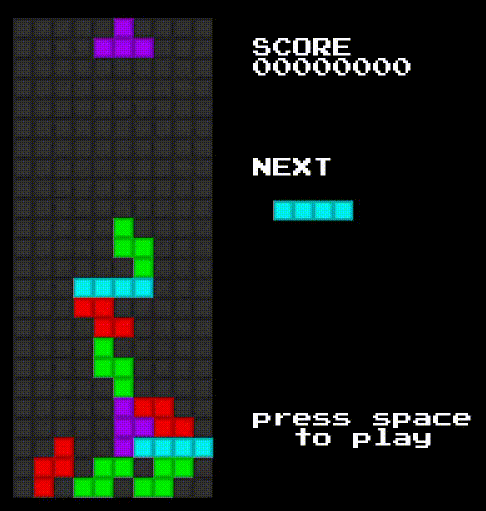

# gtris

A tetris clone in golang using [ebitengine](https://github.com/hajimehoshi/ebiten). The scope of this project was to learn about ebitengine and golang, so don't expect a complete almost-bug-free game.

I've found about ebiten by [@danicat83](https://twitter.com/danicat83)'s talk [GopherCon UK 2021: Daniela Petruzalek - Building an Indie Game in GO](https://www.youtube.com/watch?v=Oce77qCXu7I)

Play it on your browser here https://mulitasoft.itch.io/gtris

_The pieces rotation __should__ be improved_

## Building

To build for the current platform: `make build` and then run `./gtris`.

To build for the web: `make web` and all the files will be copied to the `web` directory. With `make run_web` a http server is started so the web version can be accessed locally.

## Images

The image used to create all of the pngs in `gtris/images/` is `gtris/images/block.xcf`

## Controls

- Left/Right: Move
- Up: Rotate
- Down: Drop (keep it pressed)
